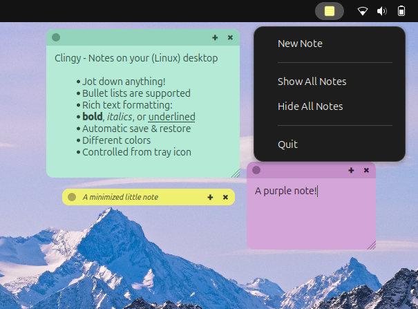

# Clingy

Create colorful sticky notes that float on your desktop. Notes
persist across restarts and the application lives in the system tray.



## Features

- **System tray** — Click the tray icon to create notes, show/hide all, or quit.
- **Color themes** — Click the color dot to pick a color theme.
- **Rich text** — Bold, italic, underline, bullet lists and font-size changes.
- **Persistence** — Notes are saved as JSON files in `~/.local/share/clingy/`.

## Keyboard Shortcuts

| Shortcut             | Action                |
|----------------------|-----------------------|
| `Ctrl+B`             | Bold                  |
| `Ctrl+I`             | Italic                |
| `Ctrl+U`             | Underline             |
| `Ctrl+Shift+L`       | Toggle bullet list    |
| `Ctrl++` / `Ctrl+=`  | Increase font size    |
| `Ctrl+-`             | Decrease font size    |
| `Ctrl+M`             | Minimize/restore      |

## Quick Start - Run from command line

Create the virtual Python environment containing Clingy's runtime dependencies.
You only need to run this command once.

```bash
./setup.sh
```

Launch the application

```bash
./run.sh
```

## Run as systemd service

Clingy can be installed as a systemd user service so it can be managed with
`systemctl` and optionally auto-started on login.

### Install

```bash
./install.sh
```

This copies the application to `~/.local/share/clingy/`, creates a virtual
environment, and installs the systemd user service.

### Manage the service

```bash
systemctl --user start   clingy   # start now
systemctl --user stop    clingy   # stop now
systemctl --user enable  clingy   # auto-start on login
systemctl --user disable clingy   # disable auto-start
systemctl --user status  clingy   # check status
journalctl --user -u clingy -f    # view logs
```

### Uninstall

```bash
./uninstall.sh          # keeps saved notes
./uninstall.sh --purge  # also removes saved notes
```

## Requirements

- Python 3.10+
- PySide6 >= 6.5.0 (installed by setup.sh)

Tested on Ubuntu 24.04 using GNOME with Wayland.
